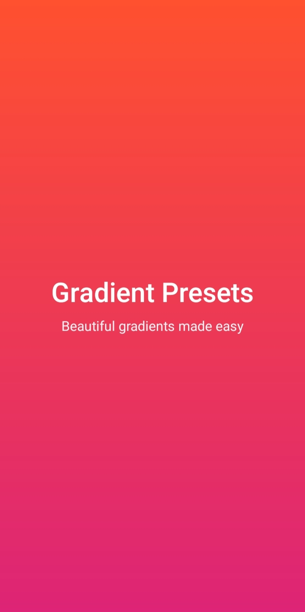
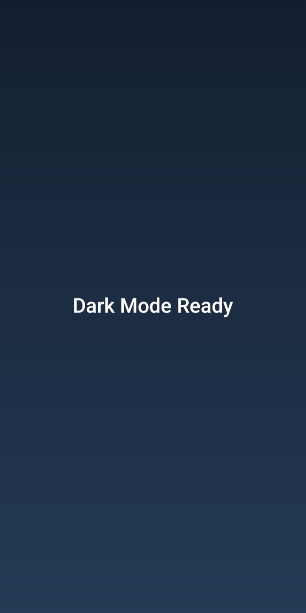
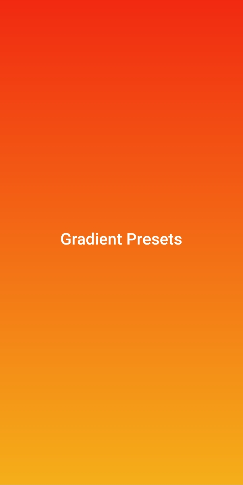
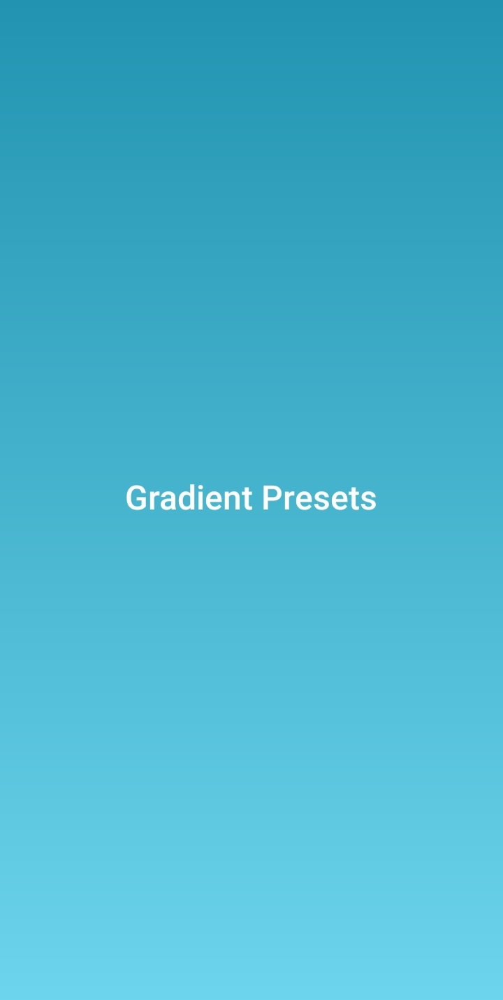
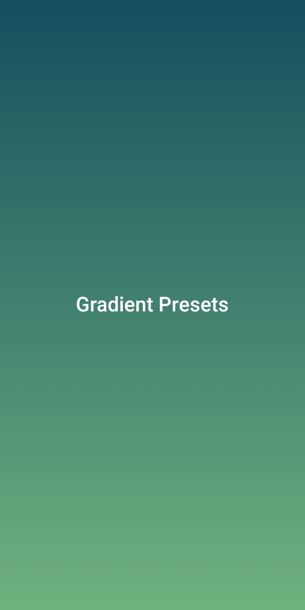
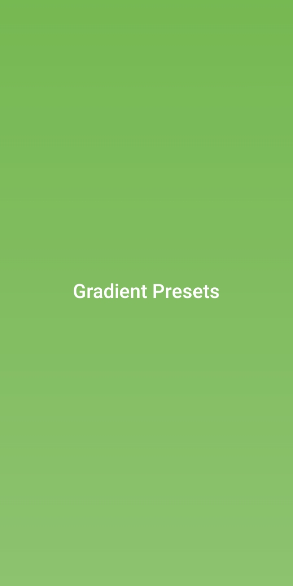
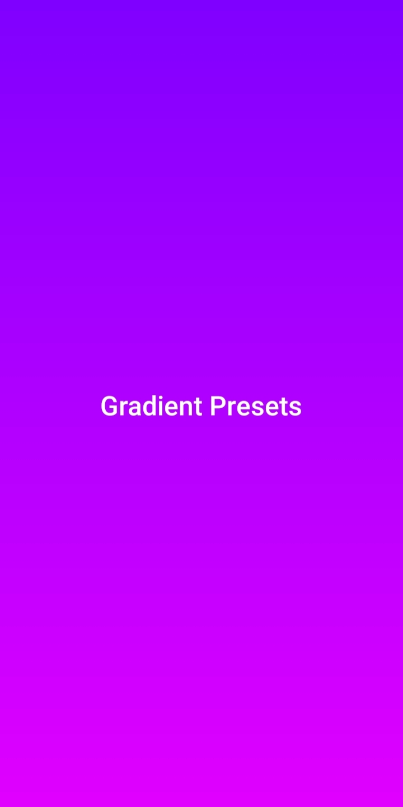
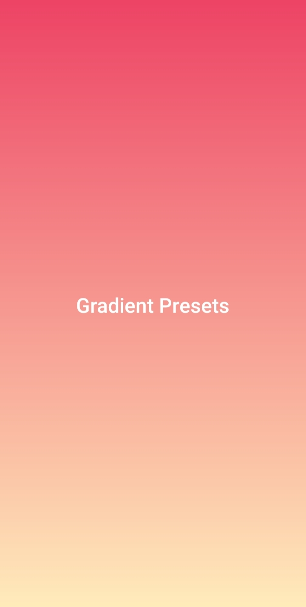

## Android Gradient Presets
[](https://kotlinlang.org/)
[](LICENSE)
[](#)
---

A lightweight and flexible Android UI library that makes it easy to apply beautiful gradient backgrounds using XML or Kotlin — with support for presets, custom colors, theme attributes, orientation, and rounded corners.

---

### Features

- Ready-to-use gradient presets
- Apply gradients directly from XML
- Support for custom start & end colors
- Support for theme attributes (?attr/colorPrimary)
- Multiple gradient orientations
- Rounded corners support
- Works with any layout or view

---

### Preview

<p align="center">
<table>
  <!-- Row 1: Titles -->
  <tr>
    <th align="center">Sunset</th>
    <th align="center">Night</th>
    <th align="center">Fire</th>
    <th align="center">Ocean/Sky</th>
  </tr>

  <tr>
    <td align="center">
      
    </td>
    <td align="center">
      
    </td>
    <td align="center">
      
    </td>
    <td align="center">
      
    </td>
  </tr>

  <!-- Row 2: Titles -->
  <tr>
    <th align="center">Forest</th>
    <th align="center">Mint</th>
    <th align="center">Lavender</th>
    <th align="center">Peach</th>
  </tr>

  <!-- Row 2: Images -->
  <tr>
    <td align="center">
      
    </td>
    <td align="center">
      
    </td>
    <td align="center">
      
    </td>
    <td align="center">
      
    </td>
  </tr>
</table>
</p>


---

## Installation (JitPack)

### 1️⃣ Add JitPack to your **root `settings.gradle` or `build.gradle`**

```gradle
dependencyResolutionManagement {
    repositories {
        google()
        mavenCentral()
        maven { url 'https://jitpack.io' }
    }
}
```
### Add Dependency
```
dependencies {
	        implementation 'com.github.Excelsior-Technologies-Community:Android_GradientPresets:1.0.0'
	}
```

---

### Quick Start (XML)

The easiest way to use the library is with GradientLayout.
```xml
<com.ext.gradientpreset.GradientLayout
    android:layout_width="match_parent"
    android:layout_height="match_parent"
    app:gradientPreset="sunset"
    app:gradientOrientation="top_bottom"
    app:gradientRadius="24dp">
</com.ext.gradientpreset.GradientLayout>
```

**Gradient Presets**

The library ships with the following built-in presets:

| Preset | Description |
|------|------------|
| `sunset` | Warm pink → red gradient |
| `fire` | Orange → yellow gradient |
| `ocean` | Blue → cyan gradient |
| `sky` | Light blue tones |
| `forest` | Deep green tones |
| `mint` | Fresh green tones |
| `lavender` | Purple gradient |
| `night` | Dark premium gradient |
| `peach` | Soft peach tones |

```xml
app:gradientPreset="ocean"
```

**Gradient Orientation**

You can control the gradient direction using `gradientOrientation`.

| Value | Direction |
|------|-----------|
| `left_right` | Left → Right (default) |
| `top_bottom` | Top → Bottom |
| `tl_br` | Top-Left → Bottom-Right |
| `bl_tr` | Bottom-Left → Top-Right |

```xml
app:gradientOrientation="top_bottom"
```

**Rounded Corners**

Apply rounded corners easily using `gradientRadius`.

```xml
app:gradientRadius="16dp"
```

**Custom Colors (XML)**

You are not limited to presets.
You can define your own gradient colors directly in XML.

```xml
app:startColor="#FF512F"
app:endColor="#DD2476"
```
Or
```xml
app:startColor="@color/startColor"
app:endColor="@color/endColor"
```

**Theme-Aware Gradients**

You can use theme attributes so gradients automatically adapt to light / dark mode.

```xml
app:startColorAttr="?attr/colorPrimary"
app:endColorAttr="?attr/colorSecondary"
```

---

### Priority Rules (Important)

The library applies gradients in this order:

- startColorAttr + endColorAttr
- startColor + endColor
- gradientPreset

If nothing is provided → no gradient is applied
This ensures no unexpected UI overrides.

---

### License

```
MIT License

Copyright (c) 2025 Excelsior Technologies 

Permission is hereby granted, free of charge, to any person obtaining a copy
of this software and associated documentation files (the "Software"), to deal
in the Software without restriction, including without limitation the rights
to use, copy, modify, merge, publish, distribute, sublicense, and/or sell
copies of the Software, and to permit persons to whom the Software is
furnished to do so, subject to the following conditions:

The above copyright notice and this permission notice shall be included in all
copies or substantial portions of the Software.

THE SOFTWARE IS PROVIDED "AS IS", WITHOUT WARRANTY OF ANY KIND, EXPRESS OR
IMPLIED, INCLUDING BUT NOT LIMITED TO THE WARRANTIES OF MERCHANTABILITY,
FITNESS FOR A PARTICULAR PURPOSE AND NONINFRINGEMENT. IN NO EVENT SHALL THE
AUTHORS OR COPYRIGHT HOLDERS BE LIABLE FOR ANY CLAIM, DAMAGES OR OTHER
LIABILITY, WHETHER IN AN ACTION OF CONTRACT, TORT OR OTHERWISE, ARISING FROM,
OUT OF OR IN CONNECTION WITH THE SOFTWARE OR THE USE OR OTHER DEALINGS IN THE
SOFTWARE.
```


